<div align="center">

# AI Voice Sales Agent

**Autonomous outbound calling system · Telugu / Hindi / English · Real-time lead qualification**


[Demo Video](https://drive.google.com/file/d/1oovhq5FskFUCzhzMVAcN0cUDYuKpUcQy/view?usp=sharing) · [Live App](https://ai-voice-sales-agent-backend.vercel.app/) · [Architecture](#architecture) · [Screenshots](#screenshots)

</div>

---

The system dials a lead on its own, pitches e-commerce website development in the language the lead answers in, runs discovery, classifies them **HOT / WARM / COLD** from indirect answers, fires a **WhatsApp mid-call** on high intent, turns spoken time into a **booked callback**, and **re-dials automatically** through a cron-driven queue.

## Summary

| | |
|---|---|
| **Places the call** | Outbound dial triggered by API or dashboard, no human on the line |
| **Languages** | Telugu, Hindi, English, including code-switched sentences |
| **Sells** | E-commerce website development, conversational not scripted |
| **Discovery** | Budget, product category, catalog size, timeline, features |
| **Classification** | HOT / WARM / COLD inferred from indirect answers |
| **Mid-call action** | WhatsApp fires on intent trigger, before the call ends |
| **Scheduling** | "call me back tomorrow morning" → resolved → booked → cron re-dials |
| **Follow-up** | Composed from actual transcript lines, not a template |
| **Dashboard** | Monitors calls, leads, callbacks, WhatsApp logs, webhooks, activity |
| **Demo video** | https://drive.google.com/file/d/1oovhq5FskFUCzhzMVAcN0cUDYuKpUcQy/view?usp=sharing |
| **Live app** | https://ai-voice-sales-agent-backend.vercel.app/ |

---

## Tech Stack

<table>
<tr><th align="left" colspan="2">Frontend</th><th align="left" colspan="2">Backend</th></tr>
<tr><td>Framework</td><td>React 18 + Vite</td><td>Framework</td><td>NestJS (Node.js)</td></tr>
<tr><td>Language</td><td>TypeScript</td><td>Language</td><td>TypeScript</td></tr>
<tr><td>Styling</td><td>Tailwind CSS</td><td>Database</td><td>MongoDB + Mongoose</td></tr>
<tr><td>Data layer</td><td>TanStack Query + Axios</td><td>Queue / Jobs</td><td><code>@nestjs/schedule</code> cron + BullMQ (Redis)</td></tr>
<tr><td>Routing</td><td>React Router</td><td>Telephony</td><td>Twilio + Vapi (outbound, streaming audio)</td></tr>
<tr><td>Charts</td><td>Recharts</td><td>STT / TTS</td><td>Sarvam AI (Indian-language speech)</td></tr>
<tr><td>Auth</td><td>JWT (httpOnly cookie)</td><td>LLM</td><td>OpenAI (reasoning, classification)</td></tr>
<tr><td>Hosting</td><td>Vercel</td><td>Messaging</td><td>WhatsApp Cloud API</td></tr>
<tr><td></td><td></td><td>Calendar</td><td>Google Calendar API</td></tr>
<tr><td></td><td></td><td>Webhooks</td><td>Vapi / Twilio → signed NestJS endpoints</td></tr>
<tr><td></td><td></td><td>Hosting</td><td>Render + MongoDB Atlas</td></tr>
</table>

---

## Architecture

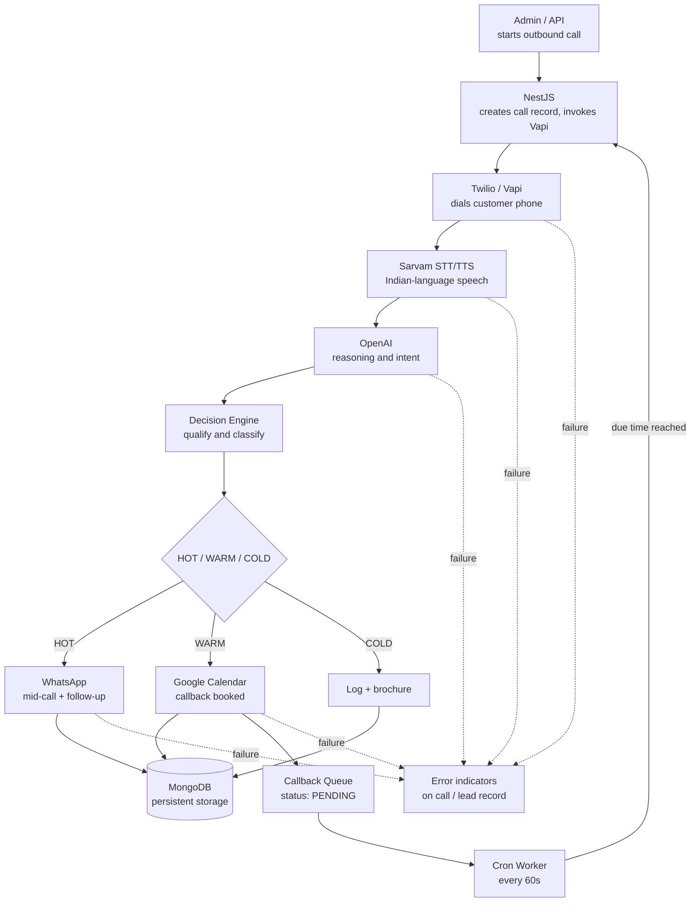

The dashboard **monitors** this flow, it does not execute it. Failures from Twilio, Vapi, Sarvam, OpenAI, WhatsApp and Calendar surface as error indicators on the call and lead records.

**Call lifecycle**

```
Dial → Speak → Discover → Understand → Classify → Act mid-call → Schedule → Follow up
```

---

## Lead Classification

| State | Signal | Action taken |
|---|---|---|
| 🔴 **HOT** | Asks price, timeline, "how soon can you start" | WhatsApp fires **before** the call ends |
| 🟡 **WARM** | Real need with a barrier: budget, timing, decision-maker | Capture the barrier, book callback, queue re-dial |
| ⚪ **COLD** | Curious, no clear need or budget | Log, send brochure, close |

---


## API Endpoints

| Method | Route | Purpose |
|---|---|---|
| `POST` | `/auth/signin` | Admin login |
| `POST` | `/calls/start` | Trigger outbound call |
| `GET` | `/calls` | List calls |
| `GET` | `/calls/:id` | Call detail + transcript |
| `GET` | `/leads` | List leads |
| `GET` | `/leads/:id` | Lead detail + classification |
| `GET` | `/callbacks` | Queued callbacks |
| `GET` | `/callbacks/:id` | Callback detail |
| `GET` | `/whatsapp` | Message log |
| `GET` | `/whatsapp/:id` | Message detail |
| `POST` | `/webhooks/vapi` | Call events, transcript stream |
| `GET` | `/activity` | System activity feed |

---

## Setup

```bash
# backend
cd backend && npm install
cp .env.example .env
npm run start:dev

# frontend
cd frontend && npm install
npm run dev
```


## Screenshots

### Sign In
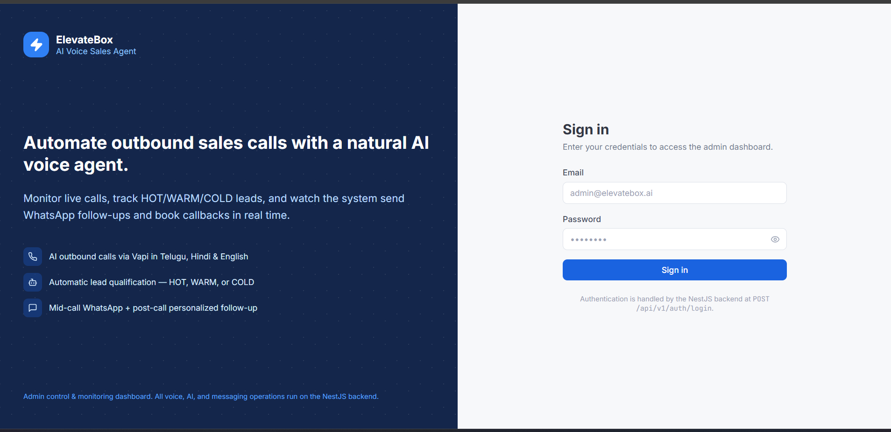

### Dashboard
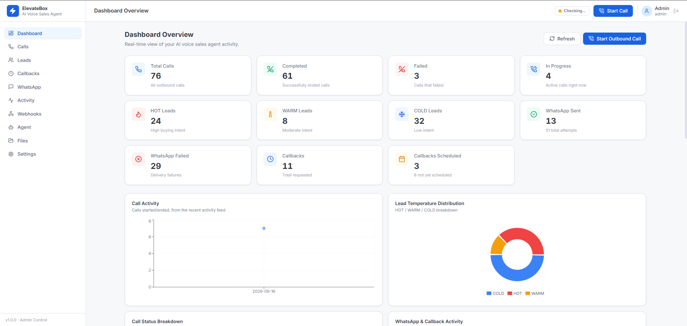
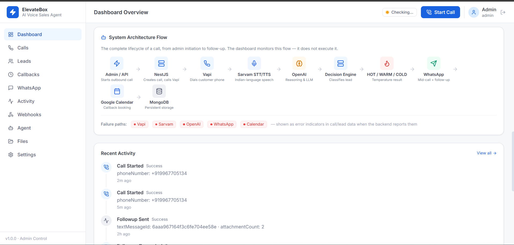

### Start Call
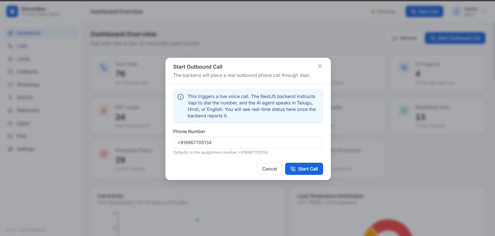

### Calls
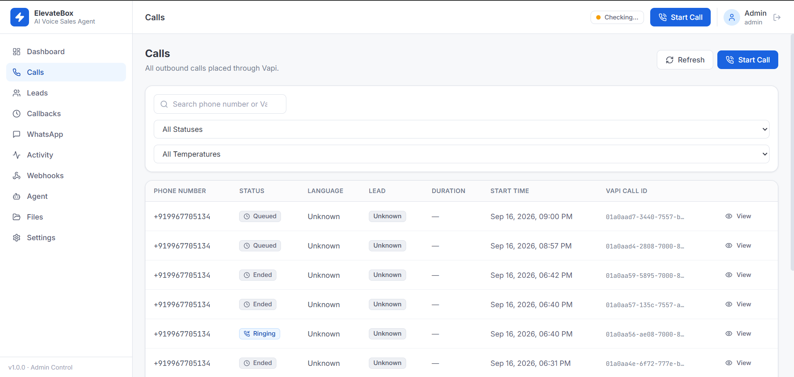
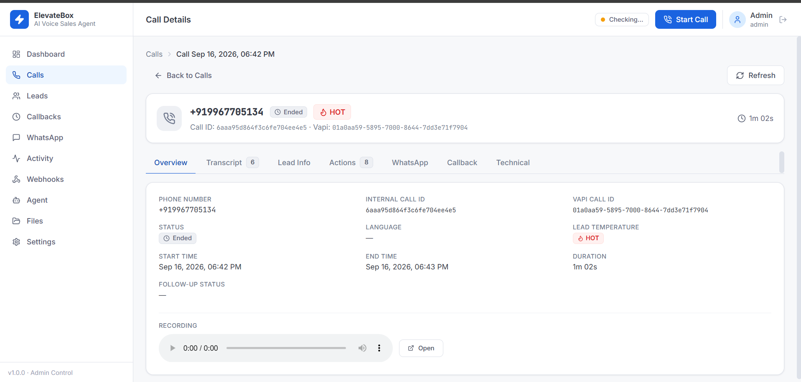

### Leads
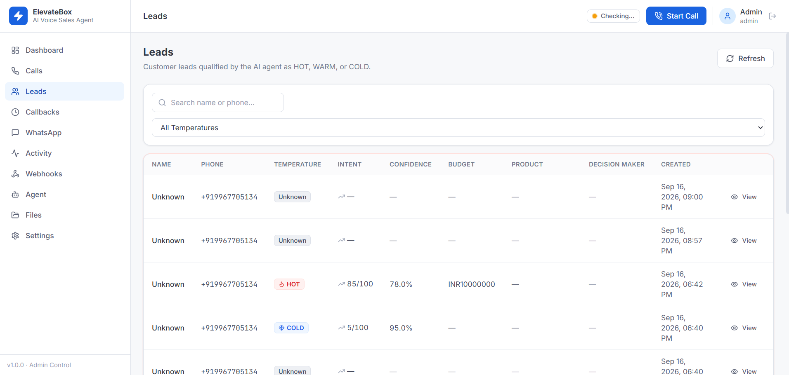
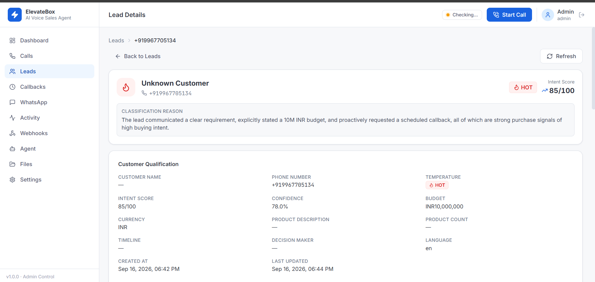

### Callbacks — cron queue
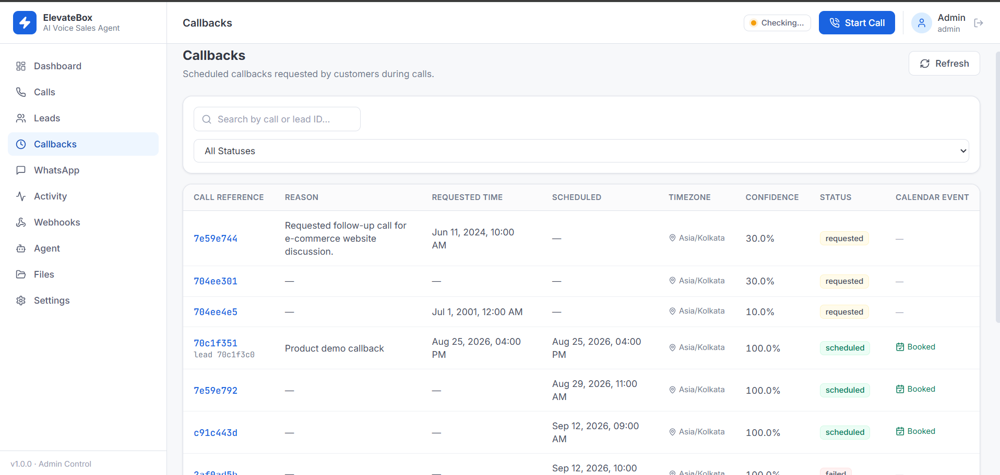
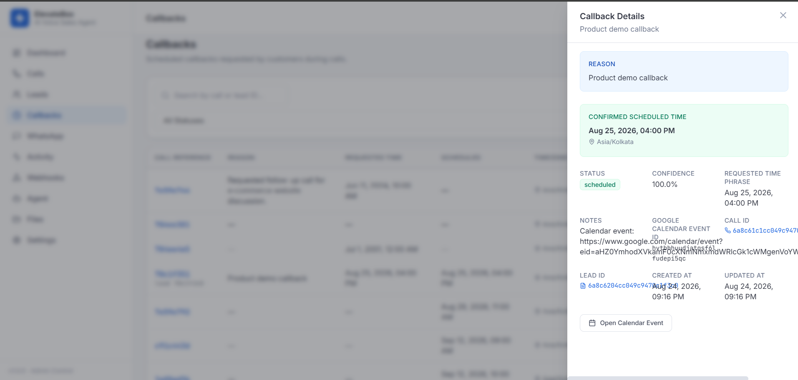

### WhatsApp
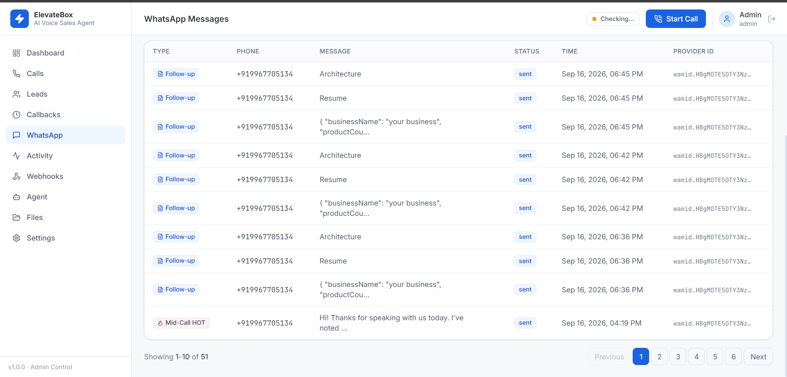
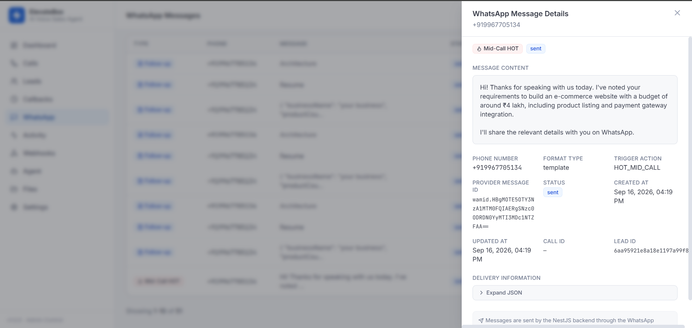

### Webhooks
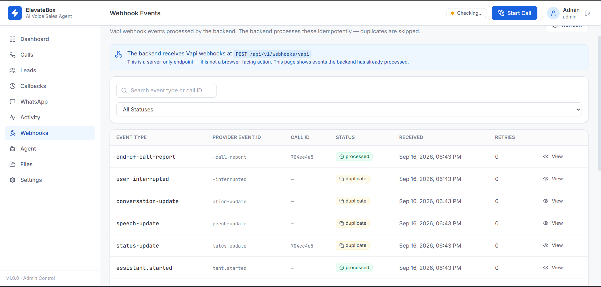

### Activity
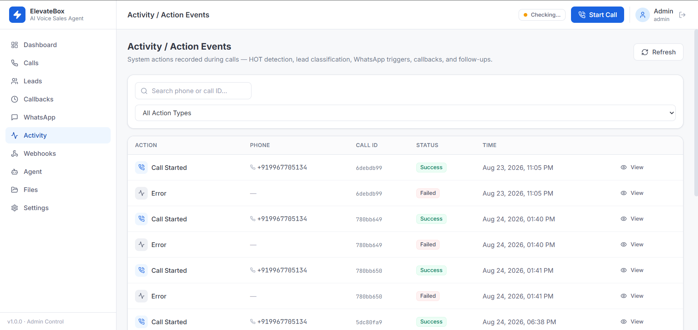

---

<div align="center">

**Built for ElevateScale Technologies Private Limited · ElevateBox · Banjara Hills, Hyderabad**

</div>